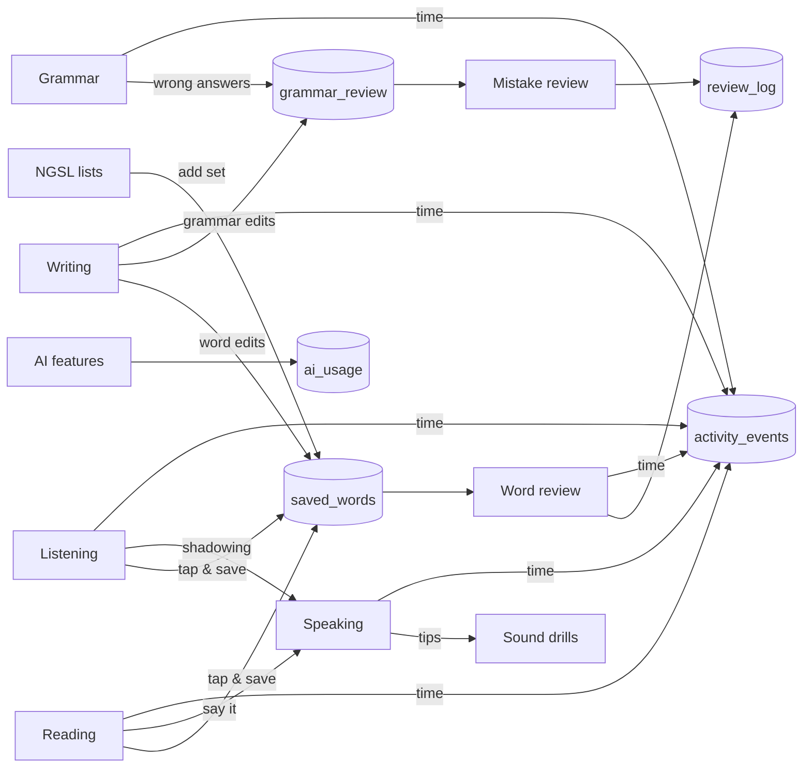

# Skill modules: how to integrate competitor features

Date: 2026-09-15
Input: `docs/research/skill-modules-competitor-study.md` (feature ids V1…, S1…, W1…, R1… refer to its tables).
Scope: how each recommended feature plugs into the current code, what has to change first, and in what order. No code has been changed for this plan.

## 1. Summary

Most features can't be added one by one yet. The current code ties words, time logging, tap-to-translate and pronunciation to **listening clips**. Eight shared pieces unblock almost everything:

| # | Shared piece | Unblocks |
|---|---|---|
| P1 | Shared dictionary (glossary moves out of listening) | Reading, word lists, manual add, writing → words |
| P2 | Word sources beyond clips | Saving from reading, lists, writing |
| P3 | Tappable text component, extracted from `ClipPlayer` | Reader, grammar examples, writing feedback |
| P4 | Tracker target registry + count events | Reading, writing and drill time; words known |
| P5 | Pronunciation reference resolver | Phrase and sound drills, scoring outside clips |
| P6 | AI provider + paid access + daily AI credits | Writing feedback, Azure scoring, sentence explanations |
| P7 | Level mapping (profile level → CEFR) | Starting list, reading level, prompt level |
| P8 | Review log | Hard words, FSRS, progress stats |

P4, P7 and P8 are small and can go first. P1–P3 come with the reading module. P5 comes with speaking drills. P6 comes just before the first paid feature.

## 2. What blocks integration today (read from the repo)

| Where | Today | Why it blocks |
|---|---|---|
| `src/content/listening/glossary.json`, `src/lib/listening/glossary.ts` | The only dictionary, built from two clips (~300 lemmas) | Reading, NGSL lists and writing need meanings for words that aren't in clips |
| `saveWordAction` (`src/app/(site)/vocabulary/actions.ts`) | Rejects a word unless `entryForLemma(lemma)` **and** `getClip(clip)` pass | Nothing outside listening can save a word |
| `SavedWordSource` (`src/db/schema.ts`), `Card` (`src/lib/vocab/review.ts`) | `{ clip?, seg? }`; card has `clip` and clip audio | A card can't say "from a text" or "from list NGSL set 3" |
| `ClipPlayer.tap` (`src/components/listening/clip-player.tsx`) | Word lookup, phrase expansion and saving live inside the player | The reader would copy about 60 lines of logic |
| `TimedTarget` (`src/lib/tracker.ts`), `logTimedAction` (`src/app/(site)/actions.ts`) | Only listening, speaking-for-a-clip, grammar and vocabulary review are accepted | Reading, writing and drill time are rejected (`return null`) |
| `buildStats` (`src/lib/tracker.ts`) | Any day with an event counts as active | A zero-point "count" event (e.g. words known) would add streak days |
| `ShadowingSession`, `assessPronunciationAction` | Take a clip and segment; reference text comes from the clip | Phrase and sound drills have no clip |
| `PracticeSession` (`src/components/listening/practice-session.tsx`) | Needs `ClipInfo` with audio; items come from `buildPractice(clip)` | Reading questions have no audio |
| `profiles.english_level` | Saved at onboarding (`src/app/onboarding/actions.ts`), not read anywhere; values are beginner…advanced, content uses A1…C1 | Nothing starts at the learner's level |
| `reviewWord`, `reviewGrammarItem` | Update the row in place; no history | No lapse counts, no data for FSRS |
| Paid access / AI | No plan field, no usage table, no text-AI provider; only `pronunciationAvailable()` | No safe way to switch on any paid feature |

## 3. Shared pieces

### P1 Shared dictionary
- Move `glossary.json` to `src/content/dictionary/` and `glossary.ts` to `src/lib/dictionary/`, with the same shape (`lemmas`, `forms`, `phrases`) and the same functions (`wordKey`, `lookupWord`, `phraseAt`, `entryForLemma`). Listening imports from the new place.
- Keep ADR 0010's rule: meanings are not stored on saved rows.
- Keep NGSL-derived entries in a separate file (`ngsl.json`) merged at load time, because of CC BY-SA (study §3.3). Credit it on the word list pages.
- **Bundle size:** `word-sheet.tsx` and `clip-player.tsx` are client components that import the glossary module, so the whole JSON ships to the browser. That's fine at 300 lemmas but not at ~3,000. Pass each page only the entries its text uses (built on the server), as a `Record<string, GlossEntry>` prop. `lookupWord` then works on that slice.

### P2 Word sources
- Turn `SavedWordSource` into a tagged union. It is jsonb, so no migration is needed:
  `{ kind: "clip", clip, seg } | { kind: "text", text, para } | { kind: "list", list, set } | { kind: "writing", submission } | { kind: "manual" }`.
  Existing rows have no `kind`; read `clip` present as `kind: "clip"`.
- `saveWordAction` takes `source` and validates it per kind (clip exists, text exists, list set exists, submission belongs to the user). `toCard` resolves audio per kind: clip audio for clips, VOA audio for texts that have it, else TTS.
- Update the migration comment and ADR 0010 (amendment).

### P3 Tappable text
- Extract `useWordPick(tokens, glossary)` and `<TappableTokens>` from `ClipPlayer` (the tap, phrase expansion and save-state logic). `ClipPlayer` then only adds timing and playback.
- Used by: reader paragraphs (R1), grammar lesson examples, writing feedback sentences (W3) and phrase drills (S2).

### P4 Tracker targets and counts
- Replace the `if` chain in `logTimedAction` with a registry, one entry per module: `ref → cap in seconds | null`. Add:
  - `reading`: text slug, cap about 3× reading time (word count ÷ 100 wpm);
  - `writing`: `prompt:<id>`, cap 3600 s;
  - `speaking`: `phrases:<set>`, `sounds:<set>` next to clip slugs.
- **Counts** (words known, texts read, takes recorded, words written): don't store them as zero-point `activity_events`, because `buildStats` would count those days as active. Either filter `kind = 'count'` out in `getDashboardStats`, or compute counts from their own tables (`known_words`, `writing_submissions`). The second is simpler: no event is needed.
- Daily quests (`dailyQuests(stats)` in `src/lib/game.ts`, built only from `TrackerStats`) can then add skill quests such as "read one text" or "write 50 words". Those counts must be added to `TrackerStats` first.

### P5 Pronunciation reference resolver
- `assessPronunciationAction` takes a reference id, never text: `{ kind: "clip", slug, seg } | { kind: "phrase", set, i } | { kind: "pair", id, side }`. `resolveReference()` returns the text from the catalog (keeps ADR 0011's rule).
- `ShadowingSession` takes `sentences: { text, audio: { src, start, end } }[]` plus a tracker target, instead of a clip.
- **Drills need real audio files**, not `speechSynthesis`. The loudness and duration comparison decodes the original audio, and browser TTS can't be decoded. Generate phrase and minimal-pair audio once, offline (e.g. Azure neural TTS, study §4.1), and host it wherever ADR 0009 hosts clip audio. Check the TTS voice terms before shipping.

### P6 AI provider, paid access and credits
- **Plan:** `profiles.plan text not null default 'free'` and `plan_until timestamptz`. Payments come later; until then, set the plan by hand for testers.
- **Usage:** a new `ai_usage` table (`user_id`, `feature` — writing_check | pronunciation | explain —, `units`, `created_at`, RLS read-own, insert only from the server). `useAiCredit(userId, feature)` checks the plan's daily limit in the learner's timezone (same `startOfDay` SQL as `reviewQueue`), then inserts a row. Refund the credit if the provider fails.
- **Text AI:** `src/lib/ai/` mirrors `src/lib/pronunciation/`: `provider.ts` (available / mock / real), `types.ts` (provider-neutral result), prompts as files. Keep it portable (CLAUDE.md: no Vercel-only APIs): a direct SDK call or the AI SDK behind this interface. Choose the model when W3 starts; the study's cost numbers assume Haiku 4.5.
- **Shared cache:** a new `ai_cache (key text primary key, output jsonb, created_at)` for outputs about catalog content only (R8 sentence explanations, V8 examples). Learner texts are never cached or shared.
- `assessPronunciationAction` calls `useAiCredit(…, "pronunciation")` before calling Azure.
- Teen consent and the privacy policy update must be done before any of this is on (study §4.3, §5.3).

### P7 Level mapping
- `cefrFor(level: EnglishLevel): CefrLevel | null`: beginner → A1, elementary → A2, intermediate → B1, advanced → B2, unsure → null (each module picks its own default) until the placement test exists. Built in step 0 (ADR 0015).
- Used to pick the first NGSL set, the reading list order, the default writing prompt and the "next" grammar lesson.

### P8 Review log
- New `review_log` table: `user_id`, `item` (`word` | `grammar`), `item_id` (saved word id or `slug|key`), `correct`, `box_before`, `box_after`, `reviewed_at`. RLS read-own.
- Insert in `reviewWord` and `reviewGrammarItem`. Start now: FSRS (V7) needs weeks of history before fitting.

## 4. Per module

Effort: S = days, M = 1–2 weeks, L = several weeks, for one developer.

### Vocabulary

| Feature (from) | How it plugs in | New data | Needs | Effort |
|---|---|---|---|---|
| V1 NGSL level lists (NGSL, Lingvist) | `src/content/words/ngsl-500.json` split into sets of 20 per CEFR band; `/vocabulary/lists` and `/vocabulary/lists/[set]` pages with word, Mongolian meaning, TTS; `addSetAction` bulk-inserts `saved_words` with `onConflictDoNothing` and source `list` | Meanings in `src/content/dictionary/ngsl.json` | P1, P2, P7 | M (content) |
| New-card limit (Anki) | Adding 20 words at once makes all 20 due today and fills the 20-card cap. Add `NEW_PER_DAY = 5` to `review.ts`: `reviewQueue` takes due reviews first, then at most 5 cards still in box 0 that were never reviewed | none | V1 | S |
| V2 Typed answer (Duolingo, Clozemaster) | `ReviewSession` picks a card type by box: box 0–1 flip card, 2–3 listen-and-pick, 4+ typed. Reuse `isTypedCorrect` from `src/lib/grammar/check.ts` | none | — | S |
| Keyboard helper (MN-specific) | `src/lib/text/keyboard.ts`: detect Cyrillic in an English answer and convert the Mongolian layout to QWERTY to suggest what was meant. Shared with writing (W2) | none | — | S |
| V4 Listen and pick | Audio from `toCard` (clip or TTS); 3 distractors from the learner's other saved lemmas with the same part of speech, else from the same NGSL set | none | P2 | S |
| V5 Hard words (Duolingo Mistakes) | Count lapses from `review_log`; a "Хэцүү үгс" section on `/vocabulary` with a mini session | none | P8 | S |
| V3 Cloze from Tatoeba (Anki, Clozemaster) | Reuse `scripts/grammar/build_bank.py` loading and licence filtering in `scripts/words/`; one reviewed sentence per lemma in `src/content/words/examples.json` with credit; card type for box 4+ | examples file | P1 | M |
| V7 FSRS (Anki) | `ts-fsrs` behind `nextReview`; add `stability`, `difficulty`, `reps`, `lapses` columns; map the two buttons to Again/Good; keep `box` for labels | columns | P8 + weeks of logs | M |

### Speaking

| Feature (from) | How it plugs in | New data | Needs | Effort |
|---|---|---|---|---|
| S1 Speaking hub (ELSA home) | Replace `<SkillPage id="speaking">` with a page that lists clips with their shadowing link, `moduleMinutes.speaking` this week, and later drill sets. Update `planned` in `skills.ts` | none | — | S |
| S2 Phrase drills (Cake, Speak) | `src/content/speaking/phrases/<set>.json` `{ en, mn, audio }`; `/speaking/phrases/[set]` renders the generalized `ShadowingSession`; tracker ref `phrases:<set>` | phrase files + generated audio | P3, P4, P5 | M |
| S3 Minimal pairs (ELSA) | `src/content/speaking/pairs.json` `{ id, a, b, sound, tip }`; step 1 listen-and-choose (choice UI from `GrammarPractice`), step 2 record both words and compare. Link each tip id in `src/lib/pronunciation/feedback.ts` to its drill set, so a scoring tip says "дасгал хийх" | pairs file + audio | P5 | M |
| S4 Azure scoring on (ELSA, Azure) | Code exists. Add the credit check (P6), the reference resolver (P5) and the ADR 0011 checklist; scoring then works for clips, phrases and pairs | `ai_usage` | P5, P6 | S |
| S5 "Did you say it?" (Web Speech) | Optional free check on phrase drills where `SpeechRecognition` exists; label it as a word check, not a score | none | S2 | S |
| S6 / S7 Unscripted answer, AI roleplay | Later. Same provider pattern; a realtime audio provider would be a separate adapter with its own credit type | `ai_usage` units per minute | P6 | M / L |

### Writing

| Feature (from) | How it plugs in | New data | Needs | Effort |
|---|---|---|---|---|
| W1 Daily prompts (Write & Improve tasks) | `src/content/writing/prompts.json` `{ id, level, mn, en, minWords, maxWords, usefulLemmas, checklist }`; `/writing` shows today's prompt for the learner's level (seeded by day, like checkpoints) plus a list; `/writing/[prompt]` has the editor, live word count, checklist and a draft in `localStorage` | `writing_submissions` (`id`, `user_id`, `prompt_id`, `text` ≤ 2,000 chars, `word_count`, `version`, `parent_id`, `created_at`; RLS own; delete allowed) | P4, P7 | M |
| W2 Keyboard helper | `src/lib/text/keyboard.ts` warns when Cyrillic appears | none | V2 util | S |
| W3 AI feedback (Duolingo Explain My Answer, Busuu) | `checkWritingAction(submissionId)`: ownership → `useAiCredit` → `src/lib/ai` returns JSON `{ edits: [{ original, suggestion, type, mn, lesson? }], summaryMn, levelEstimate }` → validate → save. **Guard:** drop any edit whose `original` isn't an exact substring of the learner's text, and any `lesson` that isn't in `TENSE_PATH`. Error `type` is a fixed list (tense, article, plural, preposition, word-choice, spelling, punctuation) shared with grammar. UI marks edits with the listening `MARK_CLASS` styles and links `lesson` to `/grammar/[slug]` | `writing_feedback` (`submission_id` PK, `output` jsonb, `model`, `created_at`) | P3, P6 | L |
| W4 Stages and rewrite (Write & Improve) | Show the 3 edits with the highest severity; "Засаад дахин илгээх" creates a new version with `parent_id`; compare error counts by type across versions | uses `version`, `parent_id` | W3 | M |
| W6 Mistakes feed review (Busuu Mistake Repair) | Words: a `word-choice` or `spelling` edit whose `suggestion` is a dictionary lemma is saved with source `writing`. Grammar: `grammar_review` rows must resolve through `findItem`, which **deletes** rows it can't resolve (`grammarReviewQueue`). Add a resolver branch for `slug = "writing"` and `itemKey = "<submission>:<edit>"` that builds a choice exercise from the learner's sentence (original vs suggestion) | none | W3 | M |
| W5 LanguageTool | Postpone. It needs a Java server, and the public API needs a backlink and has rate limits | — | — | M |

### Reading

| Feature (from) | How it plugs in | New data | Needs | Effort |
|---|---|---|---|---|
| R1 Reader (Readlang, LingQ) | `src/content/reading/<slug>.json`: `{ slug, title, summary, level, source: ClipSource, paragraphs: { tokens: string[], mn?: string }[], questions: ClipQuestion[], clip?: string }`. Reuse the listening types (`ClipSource`, `ClipQuestion`, tokens as in `Segment`). `/reading` lists texts by level (P7); `/reading/[slug]` renders `<TappableTokens>` per paragraph with `WordSheet`; saves with source `text` | text files | P1–P4 | M |
| R2 First texts (VOA, Standard Ebooks) | A script like the listening content pipeline (ADR 0009): download, keep a copy, split into paragraphs, draft glosses, review. VOA-only items with credit | text files | R1 | M (content) |
| R3 Questions (Duolingo Stories) | Extract the question step from `PracticeSession` into a component that needs no audio, or give `PracticeSession` an audio-less mode that only allows `question` items | none | R1 | S |
| R4 Word colours and known words (LingQ) | Colours come from `savedLemmas` + known lemmas on the client. "Дуусгах" marks the text's dictionary lemmas that weren't tapped or saved as known, and the learner can undo per word. The count is `select count(*)`, shown on `/reading` and the profile | `known_words` (`user_id`, `lemma`, `created_at`, PK both; RLS own) | R1, P4 | M |
| R5 Mongolian translation toggle (Beelinguapp) | `paragraphs[].mn`, drafted once offline with a translation API (study §6.3: Mongolian MT is weak) and reviewed; toggle shown for A1–A2 texts only | field in text files | R1 | M (content) |
| R6 Listen while reading (VOA) | A text with `clip` uses that clip's timings and audio; the reader highlights the playing paragraph. VOA texts that are also clips need only one file | none | R1 | M |
| R8 Explain this sentence | `explainSentenceAction(textSlug, para, sentence)` → `ai_cache` by hash of the catalog sentence → on a miss, `useAiCredit(…, "explain")` → provider. Only catalog text, so it's safe to share the cache | `ai_cache` | P6 | M |
| R9 Paste your own text | Later. Needs glossing by AI or MT for any text, and learner text can't go in the shared cache | — | P6 | M |

## 5. How the modules connect after this

## 6. Build order

Each step ships on its own. The platform pieces go into the step that first needs them.

0. **Groundwork (S):** tracker target registry (P4), `cefrFor` (P7), `review_log` (P8). ADR 0015. Done 2026-09-16; see §8.
1. **Speaking hub (S1).**
2. **Reader with 5 VOA texts (R1 + R3):** dictionary move (P1), word sources (P2), `TappableTokens` (P3), reading time. ADR 0016 (shared dictionary and word sources), ADR 0017 (reading module).
3. **Card types (V2 + V4)** and the keyboard helper. ADR 0018.
4. **NGSL starter lists (V1)** with the new-card limit.
5. **Writing prompts (W1 + W2):** `writing_submissions`, writing time. ADR 0019 (writing).
6. **Phrase drills (S2):** reference resolver (P5), generalized `ShadowingSession`, generated audio. ADR 0020 (speaking drills audio).
7. **Sound drills (S3)**, linked from pronunciation tips.
8. **Reading, more:** 20 texts (R2), known words (R4), translation toggle (R5).
9. **Paid access (P6):** plan, `ai_usage`, AI provider, privacy policy, teen consent. ADR 0021 (paid access and AI credits).
10. **AI writing feedback (W3)**, then stages (W4), then mistakes into review (W6).
11. **Azure scoring on (S4).**
12. **Later:** FSRS (V7), cloze cards (V3), hard words (V5), sentence explanations (R8), listen while reading (R6), unscripted answers and roleplay (S6, S7), import (R9).

## 7. Risks to watch while integrating

- **Streak inflation:** see P4. Any new event type must keep `buildStats` counting only real study.
- **Review rows deleted:** `grammarReviewQueue` deletes rows that `findItem` can't resolve. Any new source of grammar mistakes (W6) needs its resolver first.
- **Glossary in the client bundle:** see P1.
- **Server action body limit (1 MB):** fine for text; audio stays under 20 s as today (ADR 0011).
- **Old saved words:** P2 must keep reading rows without `kind`.
- **AI output trust:** validate every AI edit against the learner's text and the known lesson list before saving or showing it (W3).
- **Content licences:** NGSL share-alike stays in its own file; VOA credit per text; Tatoeba credit per sentence (as ADR 0014).

## 8. Progress

### Step 0: groundwork (2026-09-16)

- Built:
  - `review_log` table and migration; `reviewWord` and `reviewGrammarItem` log each answer in the same transaction as the box update.
  - `src/lib/levels.ts` (`CefrLevel`, `CEFR_LEVELS`, `cefrFor`); `GrammarLevel` and `ClipLevel` alias `CefrLevel`; the grammar path's "Дараагийнх" starts at the learner's level.
  - `TIMED_CAPS` registry in `logTimedAction`, with the same caps as before.
- Verified:
  - `tsc`, `eslint src`, migration applied to the local database.
  - As the local intermediate test member: `/grammar` marks lesson 7 (Past Simple vs Present Perfect, the first unfinished B1 lesson) as "Дараагийнх"; console clean.
  - One word review answer ("preside", remembered) wrote a `review_log` row `word | preside | true | 0 → 1`, and the saved word moved to box 1, due the next day.
  - One grammar mistake review answer (typed "studies") wrote `grammar | present-simple|She ___ English every evening. | true | 0 → 1`, matching the `grammar_review` row.
- Not verified live: the timed-log registry (review sessions were shorter than the 60 s minimum); covered by typecheck only.

### Step 1: speaking hub (2026-09-16)

- Built:
  - `/speaking` replaces the "coming soon" placeholder: total speaking minutes (tracker, guests too), a manual log button for speaking practice elsewhere, shadowing clips with sentence counts and minutes practised per clip (members), tips with a privacy line that depends on whether AI scoring is on, and a "coming soon" list (phrase drills, sound drills, AI scoring while it's off).
  - `timedSecondsByRef(userId, module)` in `src/lib/activity.ts`; `shadowingSegments(clip)` in `src/lib/listening/clips.ts`, shared with the shadowing page so counts match.
  - `skills.ts` speaking `planned` now lists only what hasn't shipped.
- No ADR: no new data or rules.
- Verified:
  - `tsc` (no errors outside the untracked `video/` folder, which isn't part of this work) and `eslint src`.
  - As the local test member at 390×844 and 1440×900: total "Нийт 3 минут", George Washington "23 өгүүлбэр · 1 мин", Yellowstone "29 өгүүлбэр · 2 мин", matching `activity_events` (78 s and 137 s); links go to each clip's shadowing page; console clean.
  - As a guest (request without cookies): page returns 200 with sentence counts and no per-clip minutes.
- Not verified: guest page in a browser (local minutes from in-browser stats).

### Step 2: reader with 5 VOA texts (2026-09-16)

- Built (ADR 0016, 0017):
  - **Shared pieces:** glossary moved to `src/content/dictionary/` + `src/lib/dictionary/` (`git mv`); `SavedWordSource` is `{kind: "clip"} | {kind: "text"}` with old rows read as clips; `saveWordAction` checks the source against the catalog; cards carry `from: {title, href}`; `useWordPick` + `TappableTokens` extracted from `ClipPlayer`; `WordSheet` moved to `src/components/words/`.
  - **Reading:** `src/lib/reading/` (types, catalog with 5 texts and 3 questions each, `readingMinutes`, `readingCapSec`); `/reading` (own level first, minutes read), `/reading/[slug]` (tappable text, save with `{kind: "text", text, para}`, credit), `/reading/[slug]/questions`; reading added to `TimedTarget` and `TIMED_CAPS`.
  - **Content tools:** `scripts/reading/sources/*.txt`, `scripts/reading/build_text.py` (initials rejoined; words glued by "…", "...", "—", "/" separated), `scripts/reading/coverage.ts`.
  - **Dictionary:** 288 → 846 lemmas, 85 → 275 forms, 24 → 87 phrases, drafted by Claude in five batches, merged with checks (valid part of speech, Mongolian text, forms point to lemmas, no existing entry overwritten), spot-checked; Civil War side glosses corrected (Confederate ≠ Холбооны). Teacher review still needed.
  - `Skill.live`: the home grid shows "Тун удахгүй" only for writing.
- Verified:
  - `tsc`, `eslint src`; coverage: 0 words without an entry in all five texts.
  - Listening after the refactor (test member): tap "served" → sheet "served ← serve"; save stored `{kind: "clip", clip: "george-washington", seg: 1}`; old rows without `kind` still show on `/vocabulary` with their clip links.
  - `/reading` (intermediate member): three B1 texts first with "Таны түвшин", then A2, B2; "2 мин уншсан" after reading.
  - `/reading/pearl-buck`: tap "Pulitzer" → phrase "Pulitzer Prize" with both meanings; save stored `{kind: "text", text: "pearl-buck", para: 1}`; `/vocabulary` links it to the text.
  - Questions (Gettysburg): right answer, wrong answer with explanation, finish "2/3 зөв", retry; reading time logged `reading | gettysburg | 126 s | 10 points` (the timed-target registry verified live).
  - Guest requests: reader returns 200 with text, questions link and credit; home grid has one "Тун удахгүй" (writing).
  - Screenshots 390×844 (list, reader, wrong answer) and 1440×900 (reader); console clean.
- Not verified: word sheet screenshot in reading, a guest in the browser, the idle cut-off (2 min) of reading time.
- Notes: the dictionary JSON is now 86 KB and ships with the word sheet; split it per page (P1) before it grows much more.

### Step 3: card types and keyboard helper (2026-09-16)

- Built (ADR 0018):
  - `modeForBox`: box 0 flip (unchanged), box 1 listen (TTS word → pick the Mongolian meaning from 4), box 2+ typed (meaning + blanked sentence → type the word). A card missed in a session returns as a flip card; a word without a dictionary entry stays flip.
  - Listen options chosen on the server in `reviewQueue` (learner's own saved words with the same part of speech first, then the dictionary; seeded by card and day); falls back to typed when three different wrong meanings can't be found. `entriesByPos` added to the dictionary.
  - `checkTypedWord` (`src/lib/vocab/answer.ts`): surface or lemma, grammar normalising, "almost" = one edit (incl. swapped letters) in 5+ letters, counts as remembered.
  - `src/lib/text/keyboard.ts`: Cyrillic input isn't graded; the card offers what it spells on an English keyboard. Windows Mongolian Cyrillic (KBDMON) from its KLC file, then Russian ЙЦУКЕН.
  - Components split into `src/components/vocabulary/cards.tsx` (FlipCard, ListenCard, TypeCard); card buttons sit in a bar above the phone tab bar (static from lg).
- Verified:
  - `tsc`, `eslint src`; scratch checks for `checkTypedWord`/`editDistance` (15) and keyboard conversion (7) pass.
  - Local test member with words put in boxes 0/1/2: flip → "Мартсан" requeued "give up" at the end as a flip card; listen card for "preside" offered даргалах with "алба хаах, ажиллах" from the learner's own "serve"; right answer showed the word, sentence, clip audio and English note.
  - Typed "sword" on the Mongolian layout ("ыцүжб"): not graded, warning with «sword» suggestion, filled and checked right. "pulitzer prise" → "Бараг зөв!" with the spelling.
  - `review_log` and boxes: listen preside 1 → 2 (due +3 days), typed sword and almost-right pulitzer prize 2 → 3 (due +7 days), forgotten give up 0 → 0; finish screen "6 үгийг давтлаа".
  - Found and fixed during the run: on phones "Үргэлжлүүлэх" fell below the fold after a long listen card; with the bar it stays visible. Screenshots 390×844 (flip, listen before/after, keyboard warning, typed right/almost) and 1440×900 (typed card); console clean.
  - The first page summary of the Mongolian layout had the top row wrong; the KLC file was used instead (ADR 0018).
- Not verified: phone keyboards (Gboard, iOS) against the Windows layout, TTS autoplay on iOS Safari before any tap, a wrong typed answer in the browser (covered by the unit check).

### Dictionary slices, open checks and a tracker fix (2026-09-16)

- **Dictionary per page (ADR 0016 amendment):** `src/lib/dictionary/lookup.ts` (lookup over a value, no data) for client code; `glossaryFor(sentences)` on the server builds each page's slice; review cards carry `entry`.
  - Before: the whole dictionary sat in a client chunk (144 KB on `/reading/pearl-buck`, 199 KB on `/listening/george-washington`, dev build). After: no client chunk contains dictionary text; each page's HTML carries its slice, 9–15 KB (17–27% of the 54 KB file).
  - Slice lookups (word and phrase) equal the full dictionary for every token of 5 texts and 2 clips; coverage still 0 missing.
- **Tracker bug found and fixed (ADR 0015 amendment):** members' pending time was sent only by server action, which the browser can cancel during unload.
  - Before the fix: a reader with ~66 s counted, then a hard reload → nothing logged; leaving through the in-app link → 83 s logged.
  - Fix: `recordTimed` (`src/lib/timed.ts`) shared by the server action and `POST /api/track/timed`; `useMeasuredTime` sends a beacon on hidden / `pagehide`.
  - After the fix: the same hard-reload test logged 75 s. The endpoint returns 401 without a session and 403 for a cross-site `Origin`.
- **Checks that were open:**
  - Reading idle cut-off: page open 240 s, tapped once at 15 s → logged 133 s (0 points, correctly, because the same text earned its points within 3 hours).
  - Guest in a browser (fresh context): reading word sheet shows both meanings and "Нэвтэрч үгээ хадгалах"; `/speaking` shows "Ярианы дадлага хараахан хийгээгүй байна", sentence counts, no per-clip minutes; A1 checkpoint finished "2/12 зөв" with the login note; no console errors.
  - Wrong typed answer: "spear" for sword → "Буруу байна", "Зөв хариулт: sword"; `review_log` correct = false, box 2 → 0, due now.
  - Listen card audio: speech no longer starts from an effect; `speechSynthesis.speak("presided")` ran once, inside the tap (`navigator.userActivation.isActive` = true).
  - Keyboards: Unicode CLDR release-42 Android and ChromeOS Mongolian layouts match the helper's letter keys; CLDR has no iOS layout.
  - Screenshots: reading word sheet (390×844), guest sheet and guest checkpoint finish (390×844), wrong typed answer (390×844), grammar checkpoint desktop (1440×900).
- `tsc` and `eslint src` pass.
- Still not verifiable here: audio and keyboard on a real iPhone.
- Note: the test browser tool's `wait_for` returned early on a 210 s wait; the idle test was re-timed with the page clock.
